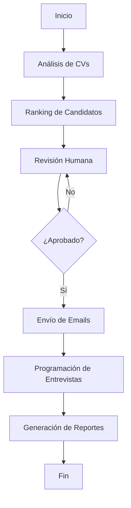

# Sistema de Automatización de Selección de Personal 🤖

Un sistema completo de automatización de reclutamiento utilizando **LangChain** y **LangGraph** para optimizar el proceso de selección de personal.

## 🎯 Características Principales

- **🔍 Análisis Inteligente de CVs**: Extracción automática de información clave usando IA
- **📊 Ranking y Filtrado**: Evaluación automática de candidatos con puntajes de compatibilidad
- **📧 Emails Automatizados**: Envío personalizado de comunicaciones a candidatos
- **📅 Programación de Entrevistas**: Integración con calendario para agendar entrevistas
- **📋 Reportes Detallados**: Generación de reportes en múltiples formatos
- **👤 Human-in-the-Loop**: Revisión humana en puntos críticos del proceso
- **🌐 API REST**: Interfaz completa para integración con otros sistemas

## 🏗️ Arquitectura del Sistema

```
┌─────────────────┐    ┌─────────────────┐    ┌─────────────────┐
│   CV Analyzer   │    │  Email Manager  │    │Calendar Manager │
│   (LangChain)   │    │   (SMTP/IA)     │    │  (Google API)   │
└─────────────────┘    └─────────────────┘    └─────────────────┘
         │                       │                       │
         └───────────────────────┼───────────────────────┘
                                 │
                    ┌─────────────────┐
                    │  HR Workflow    │
                    │  (LangGraph)    │
                    └─────────────────┘
                                 │
                    ┌─────────────────┐
                    │ Report Generator│
                    │  (Excel/JSON)   │
                    └─────────────────┘
```

## 🚀 Instalación

### 1. Clonar el repositorio
```bash
git clone <repository-url>
cd Seleccion_de_Personal
```

### 2. Instalar dependencias
```bash
pip install -r requirements.txt
```

### 3. Configurar variables de entorno
```bash
cp env_example.txt .env
```

Editar `.env` con tus credenciales:
```env
# OpenAI Configuration
OPENAI_API_KEY=tu_api_key_de_openai

# Email Configuration
SMTP_SERVER=smtp.gmail.com
SMTP_PORT=587
EMAIL_USER=tu_email@gmail.com
EMAIL_PASSWORD=tu_app_password

# Calendar Configuration (opcional)
CALENDAR_ID=tu_calendar_id
GOOGLE_CREDENTIALS_FILE=path_to_credentials.json
```

## 🎮 Uso

### Ejecutar Ejemplo
```bash
python main.py example
```

### Ejecutar API REST
```bash
python main.py
```

El servidor estará disponible en: `http://localhost:8000`

### Documentación de la API
Una vez ejecutado el servidor, visita: `http://localhost:8000/docs`

## 📁 Estructura del Proyecto

```
Seleccion_de_Personal/
├── src/
│   ├── __init__.py
│   ├── models.py              # Modelos Pydantic
│   ├── cv_analyzer.py         # Análisis de CVs con IA
│   ├── email_manager.py       # Gestión de emails
│   ├── calendar_manager.py    # Programación de entrevistas
│   ├── report_generator.py    # Generación de reportes
│   └── hr_workflow.py         # Workflow principal (LangGraph)
├── main.py                    # Aplicación principal y API
├── requirements.txt           # Dependencias
├── env_example.txt           # Variables de entorno de ejemplo
└── README.md                 # Este archivo
```

## 🔧 Componentes del Sistema

### 1. CV Analyzer (`cv_analyzer.py`)
- **Función**: Analiza CVs usando LangChain y OpenAI
- **Características**:
  - Extracción de información estructurada
  - Evaluación de compatibilidad con el perfil
  - Generación de puntajes de match (0-100)
  - Identificación de razones de match/no-match

### 2. Email Manager (`email_manager.py`)
- **Función**: Gestión de comunicaciones por email
- **Características**:
  - Plantillas personalizables
  - Generación de contenido con IA
  - Envío masivo de emails
  - Diferentes tipos: selección, rechazo, invitación a entrevista

### 3. Calendar Manager (`calendar_manager.py`)
- **Función**: Programación automática de entrevistas
- **Características**:
  - Integración con Google Calendar
  - Gestión de slots disponibles
  - Envío de invitaciones de calendario
  - Reprogramación y cancelación

### 4. Report Generator (`report_generator.py`)
- **Función**: Generación de reportes detallados
- **Formatos**:
  - Texto resumido
  - JSON detallado
  - Excel con múltiples hojas

### 5. HR Workflow (`hr_workflow.py`)
- **Función**: Orquestación del proceso completo
- **Flujo**:
  1. Análisis de CVs
  2. Ranking de candidatos
  3. Revisión humana
  4. Envío de emails
  5. Programación de entrevistas
  6. Generación de reportes

## 📊 Workflow del Proceso



## 🛠️ API Endpoints

### GET `/`
- **Descripción**: Información del sistema
- **Respuesta**: Estado y versión

### GET `/health`
- **Descripción**: Verificación de salud
- **Respuesta**: Estado de configuración

### POST `/process-recruitment`
- **Descripción**: Procesar reclutamiento completo
- **Parámetros**: `job_profile`, `cv_texts`
- **Respuesta**: Resultados del procesamiento

### POST `/upload-cvs`
- **Descripción**: Subir archivo con CVs
- **Parámetros**: `file` (archivo .txt)
- **Respuesta**: CVs extraídos

### GET `/download-report/{report_type}`
- **Descripción**: Descargar reportes
- **Parámetros**: `report_type` (summary, detailed, excel)
- **Respuesta**: Archivo del reporte

### GET `/example-data`
- **Descripción**: Obtener datos de ejemplo
- **Respuesta**: Perfil y CVs de ejemplo

## 📝 Ejemplo de Uso

### 1. Crear Perfil de Trabajo
```python
from src.models import JobProfile

job_profile = JobProfile(
    title="Desarrollador Python Senior",
    requirements=[
        "Experiencia mínima de 5 años en desarrollo Python",
        "Conocimientos sólidos en APIs REST",
        "Experiencia con frameworks como Django o FastAPI"
    ],
    skills=["Python", "Django", "FastAPI", "PostgreSQL", "Docker"],
    experience_years=5,
    languages=["Español", "Inglés"],
    location="Remoto",
    description="Buscamos un desarrollador Python senior..."
)
```

### 2. Procesar CVs
```python
from src.hr_workflow import HRWorkflow

# Inicializar workflow
workflow = HRWorkflow(openai_api_key, smtp_config, calendar_config)

# Ejecutar proceso
result = workflow.run_workflow(job_profile, cv_texts)

# Ver resultados
print(f"Candidatos procesados: {len(result['candidates'])}")
print(f"Seleccionados: {len(result['selected_candidates'])}")
print(f"Emails enviados: {result['processing_state'].emails_sent}")
```

## 🔒 Configuración de Seguridad

### OpenAI API
- Obtén tu API key en: https://platform.openai.com/api-keys
- Configura límites de uso para controlar costos

### Email (Gmail)
- Usa contraseñas de aplicación, no tu contraseña principal
- Habilita autenticación de 2 factores
- Configura en: https://myaccount.google.com/apppasswords

### Google Calendar
- Crea credenciales de servicio en Google Cloud Console
- Comparte el calendario con la cuenta de servicio

## 📈 Monitoreo y Logs

El sistema genera logs detallados en cada paso:
- Análisis de CVs con puntajes
- Emails enviados y su estado
- Entrevistas programadas
- Errores y excepciones

## 🚨 Manejo de Errores

El sistema incluye manejo robusto de errores:
- Fallback para CVs que no se pueden analizar
- Reintentos en envío de emails
- Logs detallados para debugging
- Estados de procesamiento persistentes

## 🔄 Personalización

### Modificar Criterios de Evaluación
Edita `cv_analyzer.py` para ajustar:
- Puntajes de match
- Criterios de filtrado
- Pesos de diferentes habilidades

### Personalizar Emails
Modifica `email_manager.py` para:
- Cambiar plantillas
- Ajustar tono y contenido
- Agregar nuevos tipos de email

### Configurar Calendario
Ajusta `calendar_manager.py` para:
- Cambiar horarios disponibles
- Modificar duración de entrevistas
- Configurar diferentes tipos de entrevista

## 🤝 Contribución

1. Fork el proyecto
2. Crea una rama para tu feature (`git checkout -b feature/AmazingFeature`)
3. Commit tus cambios (`git commit -m 'Add some AmazingFeature'`)
4. Push a la rama (`git push origin feature/AmazingFeature`)
5. Abre un Pull Request

## 📄 Licencia

Este proyecto está bajo la Licencia MIT. Ver el archivo `LICENSE` para más detalles.

## 🆘 Soporte

Si tienes problemas o preguntas:
1. Revisa la documentación de la API en `/docs`
2. Verifica los logs del sistema
3. Asegúrate de que todas las variables de entorno estén configuradas
4. Abre un issue en el repositorio

## 🎉 Agradecimientos

- **LangChain**: Framework para aplicaciones de IA
- **LangGraph**: Para workflows complejos
- **OpenAI**: Modelos de lenguaje avanzados
- **FastAPI**: Framework web moderno y rápido

---

**¡Automatiza tu proceso de reclutamiento con IA! 🚀**
